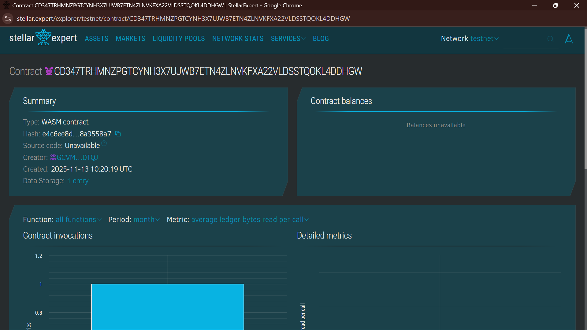

# Cross-Currency Payroll Smart Contract for Freelancers

## Project Title
**Cross-Currency Payroll for Freelancers**

## Project Description
A blockchain-based smart contract built on the Stellar network using Soroban SDK that enables seamless payroll processing for freelancers in multiple currencies. This solution allows freelancer portals to pay workers in both local and foreign currencies, leveraging the efficiency and low-cost transaction capabilities of the Stellar blockchain. The contract manages payroll records, tracks payment status, and provides real-time currency conversion functionality.

## Project Vision
To democratize global freelance payments by providing a transparent, secure, and cost-effective solution that eliminates barriers in cross-currency transactions. The vision is to empower freelancers worldwide to receive payments in their preferred currencies without the delays and high fees associated with traditional remittance services and banking intermediaries.

## Key Features

### 1. **Payroll Management**
The contract allows organizations to create and manage payroll records for freelancers. Each payroll entry includes essential information such as freelancer identification, payment amount, currency type, and payment status tracking. This ensures transparent and immutable records of all payment transactions on the blockchain.

### 2. **Multi-Currency Support**
The system supports multiple currencies including USD, EUR, INR, and other fiat and cryptocurrency representations on the Stellar network. Freelancers can receive payments in their local currency or any supported currency of their choice, providing flexibility and reducing conversion complexities.

### 3. **Real-Time Currency Conversion**
The smart contract includes built-in currency conversion functionality that utilizes exchange rates stored on-chain. This allows instant conversion between any two supported currencies at predetermined rates, ensuring freelancers know exactly how much they will receive in their preferred currency.

### 4. **Payment Status Tracking**
All payments are tracked with their status (pending or completed). This provides complete transparency to both employers and freelancers, allowing real-time visibility into payment processing and preventing duplicate payments.

### 5. **Oracle-Based Exchange Rates**
Exchange rates can be updated and maintained by authorized administrators or oracle services, ensuring current and accurate conversion rates. The system timestamps all rate updates for audit trails and transparency.

### 6. **Immutable Audit Trail**
Every transaction and state change is recorded on the Stellar blockchain, creating an immutable ledger of all payroll activities. This ensures compliance, prevents fraud, and provides complete transparency for financial audits.

## Smart Contract Functions

### Core Functions

**create_payroll(freelancer, amount, currency, description)**
- Creates a new payroll entry for a freelancer
- Returns a unique payment ID
- Sets initial payment status as pending
- Logs all transaction details

**process_payment(payment_id)**
- Marks a pending payment as completed
- Updates payment status to processed
- Prevents duplicate payment processing
- Logs successful payment execution

**convert_currency(amount, from_currency, to_currency)**
- Converts amounts between different currencies
- Uses stored exchange rates for calculation
- Returns the converted amount
- Maintains precision through rate multiplication

**set_exchange_rate(from_currency, to_currency, rate)**
- Updates exchange rates for currency conversion
- Requires proper authorization (admin/oracle)
- Timestamps all rate updates
- Stores rates with composite currency keys

**view_payroll(payment_id)**
- Retrieves complete payroll record details
- Returns default values if record not found
- Provides read-only access to payroll information........
- 

## Future Scope

### 1. **Automated Payment Routing**
Integration with Stellar's payment pathfinding to automatically determine optimal conversion routes and minimize transaction costs through atomic path payments.

### 2. **Batch Payment Processing**
Implementation of batch processing capabilities to handle multiple freelancer payments in a single transaction, reducing gas costs and improving efficiency for large-scale operations.

### 3. **Multi-Signature Approval System**
Addition of multi-signature requirements for large payroll amounts, ensuring organizational governance and adding security layers for enterprise-level payroll management.

### 4. **Oracle Integration**
Connection to decentralized oracle services like Stellar's price feeds to automatically update exchange rates in real-time, eliminating manual rate updates and ensuring accuracy.

### 5. **Tax and Withholding Automation**
Implementation of automated tax calculation and withholding based on jurisdictional requirements, with automatic filing capabilities to simplify compliance across multiple countries.

### 6. **Escrow and Dispute Resolution**
Addition of escrow mechanisms where disputed payments can be held in a smart contract with integrated dispute resolution voting systems for fair resolution.

### 7. **Mobile Wallet Integration**
Development of seamless integration with mobile wallets to allow freelancers to receive and manage payments directly on their smartphones.

### 8. **Enhanced Analytics Dashboard**
Creation of comprehensive analytics and reporting features providing insights into payment trends, currency exposure, and financial performance metrics.

### 9. **Smart Contract Upgrade Path**
Implementation of versioning and migration strategies to allow contract improvements and new features without disrupting existing deployments.

